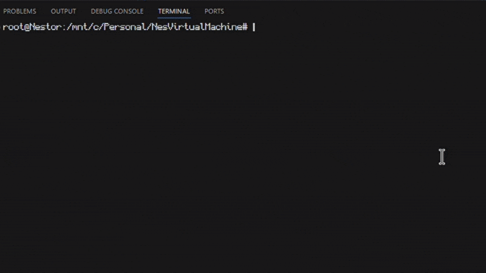

<h1>LC3 Virtual Machine </h1>
A implementation of the LC-3 (<a href="https://en.wikipedia.org/wiki/Little_Computer_3">Little Computer 3</a>) virtual machine, a low-level computer educational programming language. This is my own C code version based off of a very helpful <a href="https://www.jmeiners.com/lc3-vm/#lc-3-architecture"> article</a>.
<h2>Showcase</h2>

<h2> How to Build </h2>
This project uses a Makefile in order to ensure consistent build and run commands across environments. I also used Docker to simply add an extra layer to the environment just in case any issues with dependencies for C libraries, gcc, or makefiles. In order to run the program make sure you have Docker or DockerDesktop installed on your system of choice with your images in the correct folder and run the command

```bash
docker build -t my_lc3 .
```
in order to create the container for this program. Then run the command

```bash
docker run --rm -it -v $(pwd)/src/images:/app/src/images my_lc3 ./lc3 /app/src/images/2048.obj
```

in order to run the container with an interactive terminal and a mounted images folder along with it. I provided two images already, so you can simply replace the .obj with one of your choosing. However, Docker is not absolutely necessary as it is only a solution for non UNIX users to be able to run this program correctly. For UNIX users only, simply run the commands

```bash
make all
./lc3 $(pwd)/src/images/2048.obj
```

Also, in order to clear any compiled code, run the make clean command. Notice: you will have recompile this code using make all if you do this.


<h2> Running Tests / Debugging </h2>
I have provided in the Makefile some useful code to help in the debugging process, which is simply an unoptimized version of the default method in order to show current register values and other important information you would need. This is really helpful when you want to check the current values of registers, or if you want to check the functionality of any opcodes/trapcodes. I only provided a hello-world.obj file for a simpler unit test, but the following can be used on any other assembled code. 

```bash
# DOCKER
docker run --rm -it -v $(pwd)/src/images:/app/src/images my_lc3 gdb --args ./lc3
# UNIX
make debug
gdb ./lc3 $(pwd)/src/images/hello-world.obj
```

<h2> LC3 Architecture </h2>
<ul>
  <li>
    <p>
      The LC3 processor can be separated into three different parts which must be emulated. These include the registers, memory, and instruction decoding. The registers and memory are the main components of hardware that are emulated, however most of the code focuses on fetching and decoding the instructions from memory, and determining what operations to perform whilst updating any registers, memory, or any condition flags. This simply repeats until the program halts. The main reference point I used for decoding instructions, and what each opcode actually does can be seen in this <a href="images/lc3.pdf">pdf</a>. The LC3 is an educational compute which only has single core/thread of execution, so only one instruction can be fetched from memory at a time.
    </p>
  </li>
  <li> 
    <p> Here is a very useful abstract I used in mapping out the internals of the lc3.</p>
    
  </li>
    
</ul>

