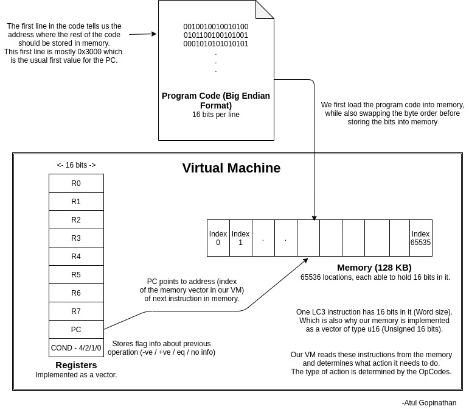

<h1>LC3 Virtual Machine </h1>
A implementation of the LC-3 (<a href="https://en.wikipedia.org/wiki/Little_Computer_3">Little Computer 3</a>) virtual machine, a low-level computer educational programming language. This is my own C code version based off of a very helpful <a href="https://www.jmeiners.com/lc3-vm/#lc-3-architecture"> article</a>.

<!--  -->

<h2> How to Build </h2>
This project uses a Makefile in order to ensure consistent build and run commands across environments. I also used Docker to simply add an extra layer to the environment just in case any issues with dependencies for C libraries, gcc, or makefiles. In order to run the program make sure you have Docker installed on your system of choice with your images in the correct folder and run the command

```bash
docker build -t my_lc3 .
```
in order to create the container for this program. Then run the command

```bash
docker run --rm -it -v $(pwd)/images:/app/images my_lc3 ./lc3 /app/images/2048.obj
```
in order to run the container with an interactive terminal and a mounted images folder along with it. I provided two images already, so you can simply replace the .obj with one of your choosing. 
